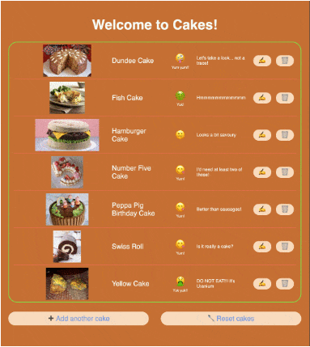

# Waracle Full Stack Challenge 16

This is _Cakes!_, my attempt at meeting the spec given in _FullStackChallenge (16).pdf_ (as supplied by andrew.weir@cathcartassociates.com)



## Prerequisites

It is 100% JavaScript so all you'll need is *node-js*.

It is built with *Meteor* see https://www.meteor.com/

## Installing

To install Meteor
```
curl https://install.meteor.com/ | sh
```

To install Cakes!

```
git clone https://github.com/majwilson/waracle-full-stack-challenge-16.git

```
You'll have a directory called waracle-full-stack-challenge-16

```
cd waracle-full-stack-challenge-16/wfsc_app
npm install

```

## Running

From the same directory as above (ie `wfsc_app`)

```
meteor

```

Then point your browser at `http://localhost:3000/`


## Notes

This is built in Meteor + React. I've not used Meteor before, but it got Mongo & React up and running + there seemed to be a reasonable eco-system for building REST support (although Meteor is typically used to perform these kinds of operations via web-sockets). There was some head scratching at times but basically it seemed like an ok choice.

Getting the server side of things going was pretty much test-driven (see wfsc_app/tests/test-cakes-server.js). But once I started on the front-end, testing took a bit of a back seat. In the real-world I'd have done tests for the front-end too, but with limited time, constant browser refreshes were a quicker alternative.

The biggest pain turned out to be form validation - I really wanted to do that on the server side but it turned out to be fairly difficult to return detailed failure info to the client (due to the way `Meteor.publish()` works). So I cut my losses and just did validation in the client (something I'd never do in the real world!).

I couldn't resist making the program handle updates to existing cakes as well as creation of new ones (it actually made working on the thing easier). I used PUT to handle updates to existing cakes, POST to handle creation of new cakes.

I probably spent more time than I should have on the front-end. From the briefing doc, Deployment hasn't really been looked at, and I've barely done anything on Resiliency. This was simply down to time. I could get a program like this deployed to (eg) AWS no problem, and improve the error handling no end.

Cheers

Mark

